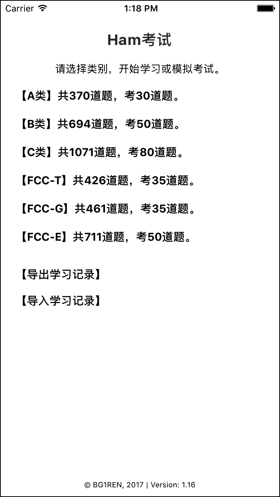
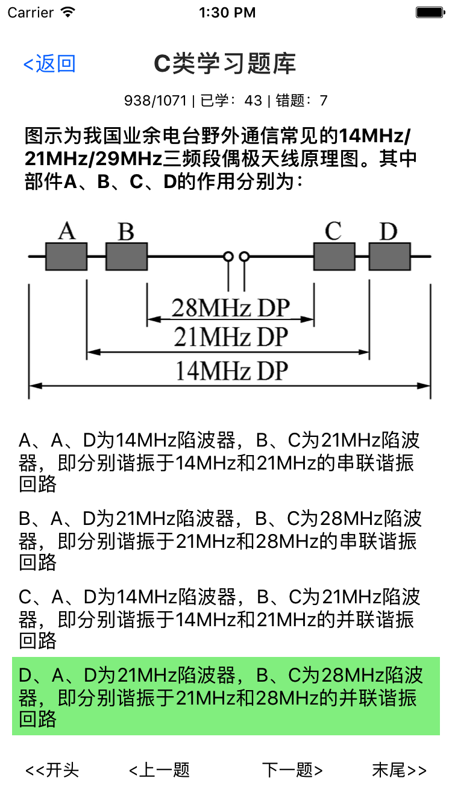
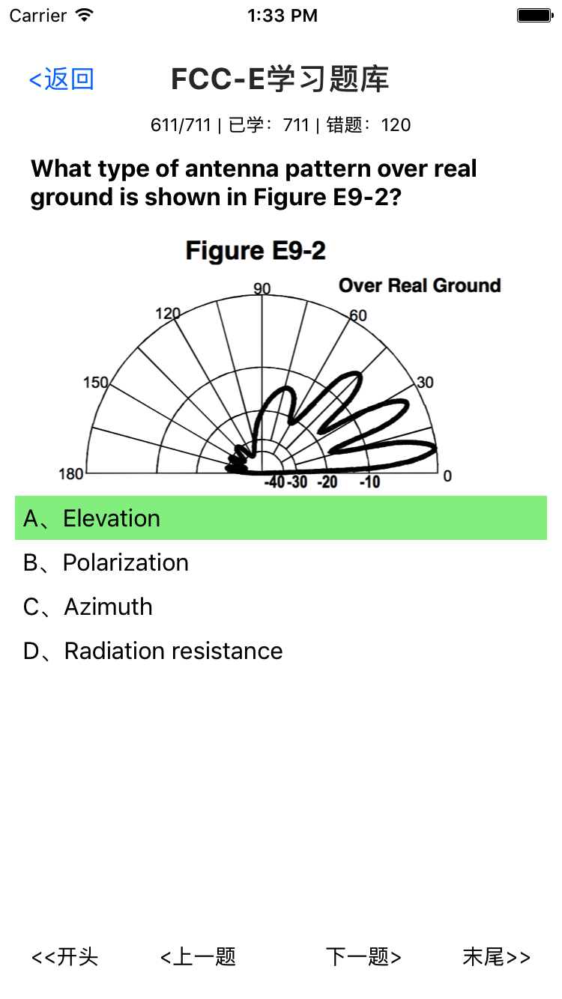
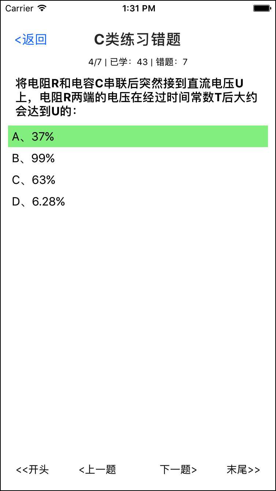
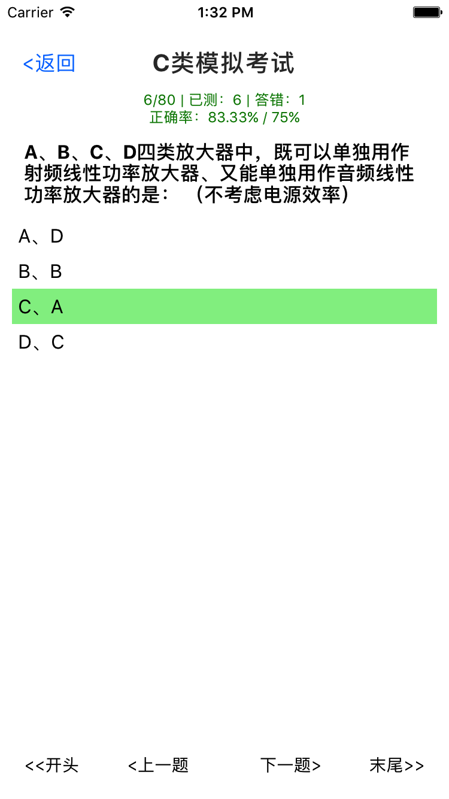
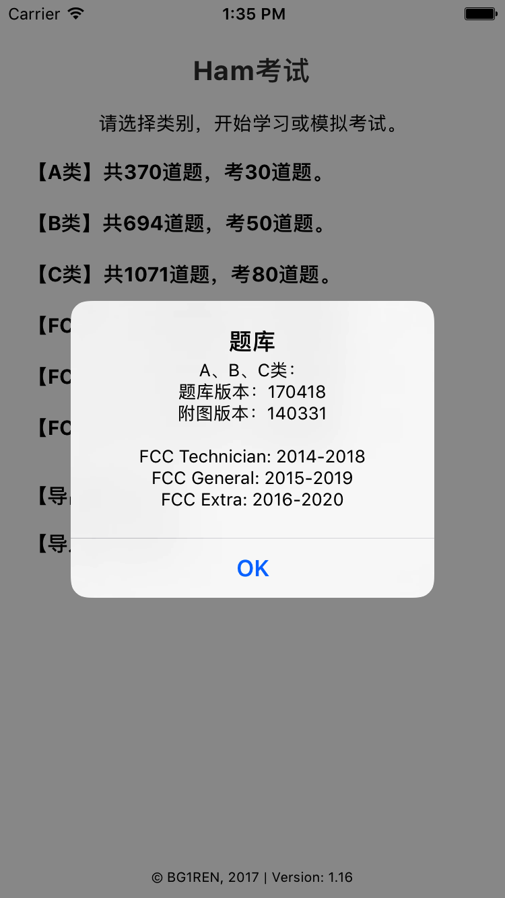

# Ham考试

这是一个帮助业余无线电技术能力认证考试的软件，用来背题。

软件含有题库：

* 国内考试的A、B、C三级题库（为170418版本，由170418版本的题和140331版本的附图构成）
* FCC Technician: 2014-2018
* FCC General: 2015-2019
* FCC Extra: 2016-2020

提供学习、练习错题和模拟考试三个主要功能。

## 界面

### 首页



### C类


### 学习





### 练习错题



### 模拟考试



### 题库版本



## 开发

软件用react-native写成。在项目目录下，可运行

```react-native run-android```

或

```react-native run-ios```

来运行。
